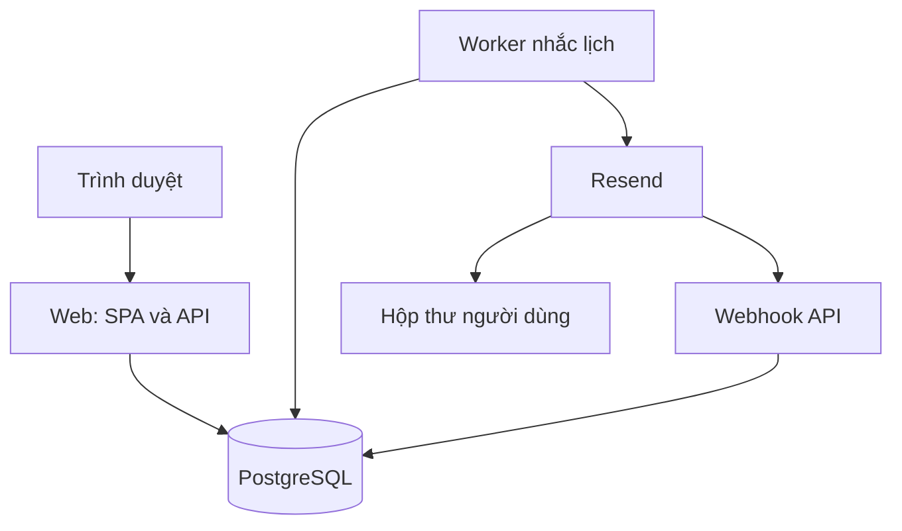
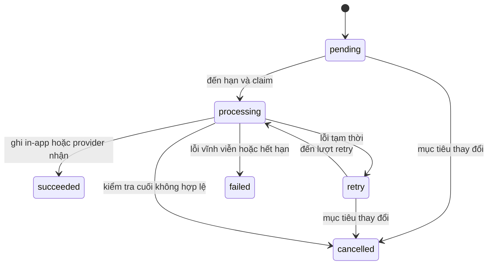

# Mây Nhỏ — Kế hoạch xây dựng web app cá nhân

> Tài liệu bàn giao cho coding agent • Phiên bản 1.0 • Ngày 18/09/2026
> Ngôn ngữ sản phẩm mặc định: tiếng Việt. Mã nguồn, tên biến và API: tiếng Anh.
> Trạng thái: đặc tả và kế hoạch triển khai; chưa có mã nguồn, hạ tầng hoặc pipeline được triển khai.

## 1. Mục tiêu và cách sử dụng tài liệu

Xây dựng **Mây Nhỏ**, một web app giúp người dùng quản lý việc cần làm, ghi chú điều cần nhớ, sắp xếp lịch cá nhân và nhận email nhắc việc tại địa chỉ Gmail của mình. Giao diện thân thiện, dễ thương vừa phải, dễ đọc và dễ sử dụng trên điện thoại lẫn máy tính.

Agent phải đọc toàn bộ tài liệu, sau đó thực hiện lần lượt các milestone ở mục 15. Các từ **PHẢI**, **KHÔNG**, **NÊN** thể hiện yêu cầu bắt buộc, điều cấm và khuyến nghị. Khi phát hiện xung đột kỹ thuật, ghi quyết định vào ADR trước khi đổi kiến trúc. Không tự mở rộng phạm vi sang ứng dụng nhóm, AI hoặc đồng bộ Google Calendar.

### 1.1. Giả định đã chốt để có thể bắt đầu

| Hạng mục | Quyết định |
|---|---|
| Đối tượng | Sinh viên, người đi làm, người muốn quản lý công việc cá nhân |
| Quy mô thiết kế đầu | 1.000 tài khoản, 100 người dùng hoạt động/ngày; kiểm thử 50 phiên đồng thời |
| Nhóm thực hiện | 1–2 developer có agent hỗ trợ |
| Thời gian ước lượng | 8 tuần, tổng khoảng 240–320 giờ; điều chỉnh sau milestone đầu |
| Đăng nhập | Google và email/mật khẩu; email phải được xác minh trước khi nhận nhắc lịch |
| Email nhận thông báo | Email đã xác minh của tài khoản, Gmail được hỗ trợ như các email khác |
| Email gửi | Địa chỉ thuộc tên miền ứng dụng, ví dụ `nhacviec@notify.example.com` |
| Múi giờ | Lấy đề xuất từ trình duyệt, người dùng xác nhận; fallback `Asia/Ho_Chi_Minh` |
| Thông báo | Email và trung tâm thông báo trong app |
| Triển khai | Docker trên Render: web service, background worker, PostgreSQL được quản lý |
| CI/CD | GitHub Actions → GHCR → staging → production; quảng bá cùng image digest |
| Ngân sách | Chọn hạ tầng trả phí không ngủ cho production; chốt chi phí trước khi tạo tài nguyên |

Các giả định trên là lựa chọn của tài liệu, không phải thông tin người dùng đã cung cấp. Agent có thể xây dựng local ngay; chỉ yêu cầu chủ dự án cung cấp domain, tài khoản dịch vụ, secrets và hạn mức chi tiêu khi bước deploy cần đến.

### 1.2. Định nghĩa đúng yêu cầu Gmail

MVP gửi email **đến Gmail cá nhân**, không gửi dưới danh nghĩa Gmail của người dùng. Vì thế không cần Gmail API, không yêu cầu mật khẩu Gmail, không xin quyền đọc thư hoặc quyền `gmail.send`. Đăng nhập Google chỉ sử dụng thông tin danh tính cơ bản.

Nếu sau này cần “gửi thư từ Gmail của tôi”, đó là một epic riêng: OAuth scope gửi thư, consent, quản lý token và yêu cầu xét duyệt tương ứng; không lén thêm vào MVP.

## 2. Phạm vi phát hành

### 2.1. P0 — bắt buộc để phát hành

- Tài khoản: đăng ký, xác minh email, đăng nhập, đăng xuất, Google login, quên/reset mật khẩu, quản lý phiên.
- To-do: danh sách cá nhân, task, checklist một cấp, trạng thái, ưu tiên, deadline, tìm kiếm/lọc, hoàn thành/khôi phục, thùng rác.
- Note: tạo/sửa/xóa, pin, tìm kiếm, Markdown an toàn, lưu tự động có thông báo trạng thái.
- Lịch: agenda, tuần, tháng; sự kiện có giờ hoặc cả ngày; xem task có deadline trên lịch.
- Reminder: tối đa 3 mốc nhắc cho mỗi task/sự kiện/ghi chú; email và thông báo trong app; hủy khi mục tiêu không còn hợp lệ.
- Preferences: múi giờ, theme sáng/tối/hệ thống, bật/tắt email, giờ yên lặng, ngôn ngữ.
- Vận hành: retry, quan sát trạng thái email, CI/CD, staging, backup, khôi phục và rollback đã diễn tập.
- Bảo vệ dữ liệu: phân quyền theo chủ sở hữu, xuất JSON, yêu cầu xóa tài khoản.

### 2.2. P1 — sau khi P0 ổn định

- Sự kiện lặp hằng ngày/hằng tuần, sửa một lần hoặc cả chuỗi; task lặp là epic khác.
- Digest buổi sáng, tag dùng chung giữa task/note, lịch sử phiên bản note.
- PWA cài lên màn hình chính; đồng bộ khi offline chỉ triển khai khi có thiết kế xung đột riêng.
- Nhập/xuất ICS, đồng bộ Google Calendar một chiều hoặc hai chiều theo thiết kế riêng.
- Đăng nhập không mật khẩu, push notification, chia sẻ read-only bằng link có thể thu hồi.

### 2.3. Ngoài phạm vi

Không có nhóm/workspace nhiều thành viên, chat, AI tự động phân lịch, thanh toán, file đính kèm, soạn thảo cộng tác realtime, ứng dụng native, Kubernetes hoặc microservices. Không đặt streak gây áp lực lên người dùng.

## 3. Tech stack và quyết định kiến trúc

### 3.1. Stack mặc định

| Lớp | Công nghệ | Mục đích và ràng buộc |
|---|---|---|
| Frontend | React 19, TypeScript strict, Vite stable | SPA phù hợp ứng dụng cá nhân sau đăng nhập; không cần SSR cho dữ liệu riêng |
| UI | Tailwind CSS 4, shadcn/ui, Lucide | Component dễ tùy biến; vẫn phải kiểm tra accessibility |
| Điều hướng/dữ liệu | React Router, TanStack Query | Routing, cache, optimistic update có rollback |
| Form | React Hook Form, Zod | Validate và hiển thị lỗi phía client; server vẫn là nguồn kiểm tra cuối |
| Lịch | FullCalendar bản tiêu chuẩn, plugin dayGrid/timeGrid/interaction | Không dùng plugin premium; có agenda dạng danh sách dễ truy cập |
| Markdown | react-markdown, remark-gfm, rehype-sanitize | Không cho HTML thô; giới hạn giao thức link |
| Backend | ASP.NET Core .NET 10 LTS | REST API, Identity, xử lý nghiệp vụ |
| Database | PostgreSQL 17, EF Core 10, Npgsql tương thích | Quan hệ, transaction, persistence cho job |
| Worker | .NET Worker Service, BackgroundService | Poll job trong PostgreSQL; không thêm Redis ở P0 |
| Thời gian | NodaTime và IANA timezone | Chuyển đổi UTC/local, xử lý DST rõ ràng |
| Danh tính | ASP.NET Core Identity + Google OIDC | Session cookie server-side; không lưu bearer token ở localStorage |
| Email | Resend qua HTTPS; Mailpit ở local | Adapter `IEmailSender`; có webhook và idempotency |
| Kiểm thử | xUnit, Testcontainers, Vitest, Testing Library, Playwright, axe-core | Unit, integration PostgreSQL thật, E2E và accessibility |
| Vận hành | Docker, GitHub Actions, GHCR, Render, OpenTelemetry | Build tái lập, triển khai cùng artifact, log/metric/trace |

Chọn stack hiện đại nhưng ổn định, không chạy theo bản preview. .NET 10 là LTS theo [chính sách hỗ trợ Microsoft](https://dotnet.microsoft.com/en-us/platform/support/policy/dotnet-core). Vite hỗ trợ build static và template React/TypeScript, xem [hướng dẫn chính thức](https://vite.dev/guide/). Dùng Node.js 24 LTS cho công cụ frontend, đối chiếu [lịch phát hành Node.js](https://nodejs.org/en/about/previous-releases) khi khởi tạo.

Agent phải pin patch thực tế đã kiểm thử trong `global.json`, `Directory.Packages.props`, `packages.lock.json`, `package.json`, `pnpm-lock.yaml`, `.node-version` và base-image digest. Không ghi `latest` vào production. Các major nêu trên là baseline; nếu dependency không tương thích, thực hiện spike và ghi ADR thay vì ép cài bằng bỏ qua peer dependency.

### 3.2. Mô hình triển khai



Một codebase backend theo module, hai process chạy độc lập: API và Worker. Frontend build thành static assets nằm trong `wwwroot` của API, cùng origin với `/api/v1`. Điều này đơn giản hóa cookie, CSRF, CORS và deploy. Local Vite proxy `/api`, `/auth` sang API HTTPS. Route API không tồn tại phải trả JSON 404, không trả `index.html` do SPA fallback.

Không dùng timer trong trình duyệt để gửi thư. Không giữ lịch nhắc chỉ trong RAM. PostgreSQL là nguồn dữ liệu quyết định lịch và trạng thái xử lý.

### 3.3. Ranh giới module

Identity, Tasks, Notes, Calendar, Notifications, Preferences, Operations. Endpoint gọi application service; application service kiểm tra quyền và business rule; infrastructure truy cập EF Core/email. Có thể tổ chức theo vertical slice bên trong module. Không cần generic repository bọc mọi thao tác EF Core, CQRS framework hoặc event bus ngoài hệ thống ở P0.

## 4. Trải nghiệm người dùng và giao diện

### 4.1. Phong cách “dễ thương nhưng dùng được hằng ngày”

- Tên tạm: **Mây Nhỏ**. Biểu tượng mây đơn giản bằng SVG tự thiết kế, chủ yếu ở empty state.
- Nền sáng `#FFF9F5`, surface `#FFFFFF`, chữ chính `#252238`, chữ phụ `#625D71`, tím chính `#6750A4`, xanh mint nền `#E3F4ED`, hồng nhạt nền `#FCE6EE`.
- Màu pastel chỉ dùng nền/điểm nhấn. Đo contrast cho mọi cặp text/background thực tế; chỉnh token nếu không đạt.
- Radius card 16px, input 10px, spacing hệ 4/8px, bóng nhẹ. Font Be Vietnam Pro tự host, fallback sans-serif; body tối thiểu 16px.
- Animation 120–180ms; tôn trọng `prefers-reduced-motion`. Không confetti toàn màn hình; hoàn thành task chỉ đổi trạng thái nhẹ.
- Nút dùng nhãn rõ: “Thêm việc”, “Tạo ghi chú”, “Lưu lịch”. Không dùng icon đơn độc cho thao tác quan trọng.
- Tone: “Hôm nay mình làm từng chút nhé”, “Chưa có việc nào. Thêm việc đầu tiên của cậu.” Cho phép tắt lời chào trang trí.

### 4.2. Điều hướng và màn hình

| Route | Nội dung chính | Yêu cầu tương tác |
|---|---|---|
| `/` | Landing ngắn, minh họa tính năng, đăng nhập | Nói rõ app gửi thư nhắc việc đến email |
| `/login`, `/register` | Form và Google login | Lỗi rõ ràng, label đầy đủ, password manager hoạt động |
| `/verify-email`, `/forgot-password`, `/reset-password` | Luồng tài khoản | Token không xuất hiện trong log; URL được dọn sau khi dùng |
| `/onboarding` | Tên gọi, timezone, xin bật email | Không tick sẵn email; có “Để sau” |
| `/app/today` | Quá hạn, hôm nay, sự kiện gần nhất | Quick add luôn dễ thấy; mục hoàn thành thu gọn |
| `/app/tasks` | Danh sách, filter, task detail drawer | Filter bằng URL; mobile detail toàn màn hình |
| `/app/notes` | Grid/list note, pinned | Trên mobile ưu tiên list; trạng thái lưu rõ ràng |
| `/app/calendar` | Agenda/tuần/tháng | Mobile mặc định agenda; mở/sửa bằng form ngoài thao tác kéo thả |
| `/app/notifications` | Thông báo, đã đọc/chưa đọc | Trạng thái email khác trạng thái đọc thông báo |
| `/app/settings` | Theme, timezone, email, giờ yên lặng | Hiển thị email đã xác minh và bản xem trước giờ nhận |
| `/app/settings/data` | Xuất dữ liệu, xóa tài khoản | Xác thực lại trước hành động nhạy cảm |

Desktop ≥1024px: sidebar 232px, nội dung có max-width 1280px. Tablet 768–1023px: sidebar thu gọn. Mobile 360–767px: thanh dưới Hôm nay/Việc/Ghi chú/Lịch, settings trong menu, nút thêm dễ chạm. Phải kiểm tra cả 320px và zoom 200%, không cuộn ngang ngoài vùng lịch có chỉ dẫn.

Mọi màn hình có loading skeleton, empty state, error kèm thử lại, success và trạng thái mạng yếu. Optimistic update dùng cho checkbox/pin; sửa lịch nhắc chỉ hiển thị thành công khi server xác nhận. Offline không giả vờ lưu thành công.

### 4.3. Accessibility và quốc tế hóa

Mục tiêu WCAG 2.2 AA: tương phản text thường ≥4.5:1, focus nhìn thấy, điều khiển bằng bàn phím, dialog giữ/trả focus, label/aria hợp lý, kích thước vùng chạm mục tiêu 44×44px. Không chỉ dùng màu biểu thị ưu tiên. Lỗi form liên kết với input; toast quan trọng có live region. Kéo thả lịch luôn có lựa chọn sửa bằng bàn phím.

Tất cả chuỗi qua i18n; P0 có tiếng Việt đầy đủ và bộ tiếng Anh tối thiểu cho các luồng chính. Hiển thị ngày theo locale nhưng không parse chuỗi ngày hiển thị để lưu database. Không gán ý nghĩa nghiệp vụ theo bản dịch.

## 5. Đặc tả nghiệp vụ

### 5.1. Tài khoản

- Email/mật khẩu: mật khẩu tối thiểu 12 ký tự, cho phép paste và passphrase; dùng Identity hasher, không tự viết crypto.
- Xác minh email: token dùng một lần, hết hạn 24h; reset password hết hạn 30 phút. Phản hồi quên mật khẩu không tiết lộ email tồn tại.
- Google login dùng OIDC authorization code, thư viện kiểm tra state/nonce/issuer/audience. Khóa liên kết là `(provider, subject)`, không chỉ email. Nếu email trùng tài khoản cũ, yêu cầu đăng nhập tài khoản đó rồi liên kết; không tự gộp.
- Google `email_verified` được kiểm tra trước khi đánh dấu email đã xác minh. Chỉ scope `openid email profile`, không lưu access/refresh token Google nếu không cần gọi API.
- Phiên idle tối đa 7 ngày, absolute tối đa 30 ngày; đăng xuất/xóa tài khoản/reset mật khẩu thu hồi phiên phù hợp. Người dùng xem và thu hồi các phiên khác.
- Đổi email: xác thực lại, gửi xác minh địa chỉ mới; giữ địa chỉ cũ đến khi xác minh xong; lúc chuyển đổi tăng phiên bản người nhận và hủy job tới email cũ.

Chi tiết danh tính đối chiếu [Google OpenID Connect](https://developers.google.com/identity/openid-connect/openid-connect).

### 5.2. Task và checklist

- Task có title bắt buộc 1–200 ký tự sau trim; description tối đa 10.000 ký tự; priority `low|medium|high`; status `todo|in_progress|done`.
- List có tên 1–80 ký tự, màu theo token cho phép. Tạo sẵn “Việc của tôi”. Xóa list phải chọn chuyển task sang list mặc định hoặc đưa tất cả vào thùng rác; không tự xóa âm thầm.
- Checklist tối đa 50 mục, mỗi mục 200 ký tự; không lồng nhau. Hoàn thành tất cả checklist không tự complete task.
- Deadline là một trong: không có, ngày không giờ, thời điểm cụ thể. Không giả định midnight cho deadline chỉ có ngày.
- Task có ngày không giờ trở thành quá hạn khi sang ngày tiếp theo trong timezone lưu trên task; task có giờ quá hạn khi `due_at < now` và chưa done.
- Complete task trong transaction đồng thời hủy reminder chưa gửi. Undo complete không khôi phục reminder đã hủy; UI mời người dùng đặt lại. Không gửi bù các mốc cũ.
- Filter theo list/status/priority/khoảng deadline; sort deadline hoặc updated_at; tìm title/description.
- Xóa mềm 30 ngày; restore không kích hoạt lại nhắc cũ. Purge có batch và audit kỹ thuật.

### 5.3. Ghi chú

- Title tối đa 200 ký tự; trống thì hiển thị “Ghi chú chưa đặt tên”; body Markdown tối đa 50.000 ký tự.
- Autosave sau 800ms không gõ, có version/ETag; hiển thị “Đang lưu”, “Đã lưu”, “Chưa lưu — thử lại”.
- Hai tab sửa cùng note: trả conflict, giữ nội dung cục bộ trong bộ nhớ để copy/so sánh, không ghi đè âm thầm. Cảnh báo trước khi rời trang có thay đổi chưa lưu.
- Không lưu nội dung note riêng tư vào localStorage mặc định. Logout dọn cache bộ nhớ.
- Note không có deadline nhưng có thể đặt nhắc tại thời điểm tuyệt đối; pin/unpin, tìm kiếm, thùng rác như task.
- Markdown không render HTML thô, script, iframe hoặc link `javascript:`. Link ngoài thêm thuộc tính an toàn.

### 5.4. Lịch

- Event có title 1–200 ký tự, description ≤10.000, location ≤300, màu và timezone IANA.
- Event có giờ: `end_at > start_at`; giới hạn khoảng dài tối đa 31 ngày ở P0.
- Event cả ngày dùng `start_date`, `end_date_exclusive`; ví dụ một ngày 20/09 là `[20/09,21/09)`.
- Lịch hiển thị event và task có deadline với kiểu phân biệt; kéo task đổi deadline, kéo event đổi start/end nhưng phải thông qua API và xử lý conflict.
- Cho phép lịch trùng; cảnh báo nhẹ, không chặn. Không có mời người tham dự ở P0.
- Đổi timezone profile chỉ đổi cách hiển thị. Event/task/reminder đã tạo giữ timezone hoặc instant ban đầu trừ khi người dùng sửa rõ ràng.
- P0 không hỗ trợ recurrence. Không tạo UI “lặp lại” nhưng backend bỏ qua.

### 5.5. Reminder và giờ yên lặng

| Loại | Quy tắc |
|---|---|
| Task có giờ/event có giờ | Tại thời điểm mục tiêu hoặc trước 5/15/30/60 phút, 1 ngày; cho nhập offset tùy chỉnh 0–43.200 phút |
| Task chỉ ngày/event cả ngày | Người dùng chọn giờ local cụ thể trên ngày đó hoặc ngày trước; mặc định gợi ý 09:00 và phải xác nhận |
| Note | Chọn ngày giờ tuyệt đối |
| Số lượng | Tối đa 3 reminder trên một đối tượng; trùng cùng thời điểm và kênh bị từ chối |
| Kênh | In-app luôn có; email chỉ khi người dùng opt-in, email verified và không bị suppress |
| Thời điểm đã qua | API trả 422; UI đề nghị chọn lại, không tự gửi ngay |
| Giờ yên lặng | Mặc định tắt; gợi ý 22:00–07:00, timezone của thiết lập |
| Trì hoãn | Chỉ trì hoãn email, in-app vẫn tạo đúng giờ; nếu giờ gửi sau thời điểm mục tiêu thì bỏ email đó và ghi lý do |
| Tắt email | Hủy email đang chờ; bật lại không tạo lại job đã hủy |
| Lỗi gửi | In-app vẫn tồn tại; không chặn tạo task/note/event |

UI hiển thị giờ gửi thực tế sau tính giờ yên lặng. Khi sửa giờ yên lặng, worker phải tính lại điều kiện của job chưa gửi. Thay đổi nội dung hoặc thời gian mục tiêu tăng schedule version và vô hiệu hóa job cũ.

## 6. Mô hình dữ liệu

UUID cho khóa chính; timestamps kỹ thuật dùng `timestamptz` UTC; ngày cả ngày dùng `date`; timezone lưu chuỗi IANA. Mỗi entity người dùng có `user_id`, `created_at`, `updated_at`; đối tượng có thể sửa có `version bigint` tăng đơn điệu. Không dùng thời gian client làm version.

| Bảng | Cột chính ngoài trường chung | Ràng buộc quan trọng |
|---|---|---|
| Identity tables | user, password hash, external login, tokens | Dùng cấu trúc Identity chuẩn; unique normalized email |
| user_profiles | user_id, display_name, timezone, locale, theme | timezone hợp lệ |
| user_preferences | email_enabled, quiet_start/end, quiet_timezone, recipient_version | Một dòng/user |
| user_sessions | id, user_id, expires_at, absolute_expires_at, revoked_at, ticket | Ticket mã hóa; không lưu session ID dạng clear trong log |
| task_lists | id, user_id, name, color, is_default | Một list mặc định/user |
| tasks | list_id, title, description, status, priority, due_kind, due_at, due_date, timezone, completed_at, deleted_at, version | CHECK due_kind tương ứng đúng bộ cột |
| checklist_items | task_id, text, is_done, position | FK cùng owner; vị trí ổn định |
| notes | title, body_markdown, pinned, deleted_at, version | Giới hạn độ dài tại API và database nếu phù hợp |
| calendar_events | title, description, location, all_day, start_at/end_at, start_date/end_date_exclusive, timezone, deleted_at, version | CHECK đúng cặp thời gian, end lớn hơn start |
| reminders | user_id, task_id?, note_id?, event_id?, scheduled_at, target_at?, email_enabled, schedule_version, state | Chính xác một FK target khác NULL; tối đa 3 active/target tại transaction |
| notification_jobs | reminder_id, schedule_version, channel, available_at, status, attempts, lease_until, lease_token, first_attempt_at, recipient_version, payload_json, provider_id, last_error_code | Unique(reminder_id,schedule_version,channel) |
| notifications | user_id, reminder_id, schedule_version, title_snapshot, target_path, read_at, created_at | Unique(reminder_id,schedule_version); FK target không bắt buộc để giữ lịch sử |
| webhook_events | provider_event_id, received_at, type, provider_message_id, processed_at | Unique provider_event_id |
| email_suppressions | normalized_email, reason, created_at | Hard bounce/complaint chặn gửi tiếp |
| worker_heartbeats | worker_id, last_seen_at, release_sha | Theo dõi sống/chết worker |
| operation_audits | actor_id?, action, entity_id?, correlation_id, created_at | Không lưu body note/password/token |
| data_protection_keys | key_id, encrypted_xml, created_at | Persist key ring, bảo vệ bằng certificate bên ngoài DB |
| system_settings | notifications_paused, maintenance_mode, updated_at | Quyền sửa qua công cụ vận hành có xác thực |

Không dùng cặp `entity_type/entity_id` thiếu FK cho reminder. Tạo composite unique `(id,user_id)` ở target và composite FK từ bảng con để ngăn liên kết khác owner. Với reminder, CHECK chính xác một target và composite FK nullable phù hợp PostgreSQL.

Indexes tối thiểu: tasks `(user_id,status,due_at)` và `(user_id,due_date)` với `deleted_at IS NULL`; notes `(user_id,updated_at DESC)`; events `(user_id,start_at)` và dates; notification_jobs `(available_at,id)` partial cho pending/retry; `(lease_until)` cho processing; notifications `(user_id,created_at DESC)`; reminders theo từng target. Tìm kiếm P0 dùng escaped ILIKE parameterized, tối đa 100 ký tự truy vấn và phân trang. Đo trước khi bổ sung trigram/FTS cho tiếng Việt.

Xóa user phải cascade hoặc purge có thứ tự mọi dữ liệu cá nhân. Dữ liệu trong backup hết hạn theo retention; tài liệu privacy không hứa xóa tức thì khỏi backup.

## 7. Hợp đồng API

Base `/api/v1`. Auth cookie cùng origin; response JSON camelCase, time có giờ là ISO 8601 UTC có `Z`, date là `YYYY-MM-DD`. Mọi query dữ liệu phải ràng buộc owner từ session, không nhận `userId` để quyết định quyền.

| Nhóm | Endpoint tối thiểu |
|---|---|
| Auth | `POST /auth/register`, `/auth/login`, `/auth/logout`, `/auth/verify-email`, `/auth/forgot-password`, `/auth/reset-password`; `GET /auth/csrf`, `/auth/me` |
| Google | `GET /auth/google/start`, callback OIDC `/auth/google/callback`; link account là flow có xác thực riêng |
| Email/phiên | `POST /auth/email-change`, `/auth/email-change/confirm`; `GET /auth/sessions`; `DELETE /auth/sessions/{id}` |
| Lists | `GET/POST /lists`; `PATCH/DELETE /lists/{id}` |
| Tasks | `GET/POST /tasks`; `GET/PATCH/DELETE /tasks/{id}`; `POST /tasks/{id}/restore` |
| Checklist | `POST /tasks/{id}/checklist`; `PATCH/DELETE /tasks/{id}/checklist/{itemId}` |
| Notes | `GET/POST /notes`; `GET/PATCH/DELETE /notes/{id}`; `POST /notes/{id}/restore` |
| Events | `GET/POST /events`; `GET/PATCH/DELETE /events/{id}`; `POST /events/{id}/restore` |
| Lịch tổng hợp | `GET /calendar?from=...&to=...&timezone=...` |
| Reminder | `GET/POST /tasks/{id}/reminders`, tương tự notes/events; `PATCH/DELETE /reminders/{id}` |
| Notification | `GET /notifications`; `PATCH /notifications/{id}` với read=true; `POST /notifications/read-all` |
| Preferences | `GET/PATCH /preferences`; `POST /preferences/test-email` giới hạn tần suất |
| Data | `GET /account/export`; `DELETE /account` sau re-auth |
| Webhook | `POST /webhooks/resend` không auth cookie, bắt buộc xác minh chữ ký |
| Health | `/health/live`, `/health/ready`, `/version`; không chứa secrets |

Google endpoints trong bảng được hiểu dưới base `/api/v1`, URI callback đăng ký phải khớp URL thật. Auth middleware phải dùng đúng path; không tự thêm một callback khác trong code và quên cập nhật Google Console.

List trả `{items,nextCursor}` với limit mặc định 20, tối đa 100, sort có ID tie-breaker. Cursor phải ràng buộc filter hoặc reject khi không tương thích. Calendar giới hạn khoảng truy vấn 93 ngày. Mọi input validate phía server.

GET detail trả ETag từ version; PATCH/DELETE yêu cầu `If-Match`, thiếu trả 428, cũ trả 412. Tạo task/event/reminder hỗ trợ `Idempotency-Key`: lưu request hash và kết quả theo user/route/key trong 24h; cùng key khác payload trả 409. Agent thêm bảng `api_idempotency_records` cho hợp đồng này, unique theo user/route/key, xử lý cạnh tranh trong transaction.

Ví dụ tạo task và nhắc atomically:

```http
POST /api/v1/tasks
Content-Type: application/json
X-CSRF-TOKEN: <token>
Idempotency-Key: <uuid>

{
  "listId": "<uuid>",
  "title": "Nộp báo cáo tuần",
  "priority": "high",
  "due": {
    "kind": "datetime",
    "at": "2026-10-02T10:00:00Z",
    "timezone": "Asia/Ho_Chi_Minh"
  },
  "reminders": [{"minutesBefore": 30, "emailEnabled": true}]
}
```

Server lưu task/reminder/jobs trong cùng transaction, trả 201 và Location. UI hiển thị deadline 17:00, nhắc 16:30 giờ Việt Nam. Reminder tạo riêng sau này dùng cùng application service và invariants.

Lỗi theo Problem Details gồm `type,title,status,detail,instance,code,traceId,errors?`. 400 dữ liệu sai cấu trúc, 401 chưa đăng nhập, 403 hành động không được phép, 404 entity không tồn tại hoặc khác owner, 409 xung đột nghiệp vụ, 412 stale version, 422 thời gian/nghiệp vụ không hợp lệ, 429 quá giới hạn. Không trả stack trace.

Sinh OpenAPI ở build; generate TypeScript client từ contract và CI kiểm tra không drift. Server là nguồn contract, không duy trì DTO thủ công trùng lặp phía client.

## 8. Cơ chế gửi nhắc lịch tin cậy

### 8.1. Lưu lịch và lấy job

1. API xác thực owner, timezone, thời gian và opt-in.
2. Trong một transaction, lưu entity, reminder và job tương lai cho từng kênh. Đây là durable outbox kiêm hàng đợi trong DB.
3. Worker poll mỗi 15 giây, batch tối đa 100, concurrency gửi email ban đầu 5 và có rate limiter theo quota provider.
4. Claim bằng transaction ngắn với `FOR UPDATE SKIP LOCKED`, đổi processing, ghi lease token mới, lease 2 phút; commit trước khi gọi dịch vụ ngoài.
5. Worker kiểm tra lại target còn tồn tại, chưa done/deleted, schedule version và recipient version còn đúng; email enabled/verified, quiet hours, suppression và kill switch.
6. Tạo thông báo in-app có unique key hoặc gửi email; update kết quả với điều kiện lease token vẫn khớp. Worker không được ghi đè kết quả của worker đã reclaim lease.
7. Process chết: reaper reclaim lease hết hạn. DB row lock không giữ trong lúc gọi HTTP. HTTP timeout 15s, gia hạn lease nếu cần; graceful shutdown ngừng claim và hoàn tất/nhường job đang chạy.



### 8.2. Chống trùng và cửa sổ lỗi

- Key provider: `reminder/{reminderId}/v{scheduleVersion}/email`; payload đóng băng ở lần gửi đầu và giữ nguyên cho retry.
- Unique DB ngăn hai job cho cùng lần nhắc; không đủ để ngăn cửa sổ provider nhận thư nhưng worker chết trước khi ghi DB. Vì vậy phải dùng thêm idempotency của provider.
- Resend giữ key 24h theo [tài liệu idempotency](https://resend.com/docs/dashboard/emails/idempotency-keys). Retry tự động tối đa 6 lần tổng cộng, lịch sau lần đầu: 30s, 2m, 10m, 30m, 2h, có jitter và tôn trọng Retry-After.
- Không retry quá 23h kể từ `first_attempt_at`. Nếu kết quả vẫn không rõ, chuyển `delivery_unknown`, cảnh báo người vận hành; không tự gửi lại với key mới. Đây là giới hạn bảo đảm, không hứa exactly-once vô điều kiện.
- `succeeded` ở job email nghĩa provider đã chấp nhận. Trạng thái phát thư riêng: accepted/delivered/bounced/complained/unknown. Delivered không chứng minh vào Inbox hoặc đã được đọc.
- Chỉnh sửa/complete có thể trùng với HTTP send đang thực hiện. Cam kết hủy các job chưa dispatch; email đã được provider chấp nhận không thể thu hồi. UI và test phải phản ánh điều này.

### 8.3. Sửa/xóa, trễ và timezone

- Trong transaction sửa: lock entity/reminder; tăng schedule version; cancel job pending/retry cũ; tạo job mới. Job đang processing phải recheck version ngay trước dispatch.
- Mọi chỉnh sửa title/time ảnh hưởng payload phải tạo phiên bản mới; job retry không sửa payload cùng key. Ngăn một job chưa gửi dùng email nhận đã đổi.
- Sau downtime: in-app tạo một lần có cờ “nhắc trễ”; email chỉ gửi nếu còn trước `target_at` và trễ không quá 60 phút. Reminder không có target_at như note: cho phép trễ tối đa 60 phút. Nếu không đạt, mark expired và chỉ giữ in-app.
- Giờ local bị thiếu do DST: từ chối thời gian người dùng nhập và đề nghị giờ hợp lệ. Giờ lặp do DST: yêu cầu chọn offset; UI có lựa chọn rõ. Giờ yên lặng tự động gặp DST gap thì chuyển đến instant hợp lệ đầu tiên; overlap chọn offset muộn để không gửi sớm.
- Database giữ instant UTC và timezone; không cộng thủ công “+7” vào chuỗi. Test cả `Asia/Ho_Chi_Minh` và một timezone có DST.

### 8.4. Deliverability và chống lạm dụng

- Xác minh domain gửi với SPF/DKIM theo [Resend Domains](https://resend.com/docs/dashboard/domains/introduction); thiết lập DMARC và kiểm tra alignment trên thư thử.
- Email HTML responsive và plain-text; tiêu đề ngắn, giờ theo timezone người dùng, CTA mở app; không đưa toàn bộ note vào email. Cho phép chế độ riêng tư chỉ ghi “Cậu có một việc cần xem”.
- Không spoof From thành Gmail cá nhân. Không dùng SMTP password của chủ dự án để phục vụ mọi người.
- Thêm link “Tắt email nhắc việc”: token ký riêng scope opt-out, không chứa dữ liệu nhạy cảm. GET hiển thị trang xác nhận, POST mới thay đổi để tránh mail scanner tắt nhầm. Hỗ trợ one-click unsubscribe qua endpoint riêng nếu áp dụng header tương ứng.
- Webhook xác minh signature trên raw body, replay window theo SDK, dedupe event ID; lưu bền trước khi trả 2xx, xử lý không phụ thuộc thứ tự. Bounce/complaint bật suppression. Xem [Resend Webhooks](https://resend.com/docs/webhooks/introduction).
- Quota mặc định 50 email nhắc/user/ngày theo timezone preferences; phần vượt quota chỉ in-app. Global quota theo gói provider; không để một user gây cạn toàn bộ quota. Đếm quota atomically, không đếm thêm retry cùng job.
- Email test tối đa 3/giờ/user. Đăng ký/reset/verify có giới hạn theo IP và email, không dùng chung quota reminder.

## 9. Bảo mật, dữ liệu và hiệu năng

- HTTPS bắt buộc. Session cookie `__Host-...`, Secure, HttpOnly, Path=/, không Domain; SameSite=Lax cho phiên; cookie OIDC correlation theo cấu hình middleware phù hợp redirect.
- Bật antiforgery cho mọi mutation dùng cookie, kể cả login/logout; frontend lấy token từ endpoint riêng và gửi header. Webhook dùng signature thay vì CSRF; không vô hiệu hóa CSRF toàn app.
- Dùng database-backed ticket store cho session. Data Protection keys persist trong DB, mã hóa bằng certificate được mount dạng secret, cùng application name giữa replicas. Lưu key/certificate cũ khi rotate để đọc phiên đang tồn tại.
- CORS production không bật wildcard; same-origin là mặc định. Chỉ tin forwarded headers từ proxy được cấu hình, tránh giả host/scheme và open redirect. ReturnUrl chỉ cho phép path nội bộ.
- Owner authorization ở mọi query/update/delete; test truy cập chéo với ít nhất hai user. Soft delete không thay cho authorization.
- CSP theo tài nguyên thực sự dùng, không `unsafe-eval`; chống MIME sniffing, referrer policy, HSTS sau khi HTTPS ổn định. Query parameterized, không log body note hoặc token.
- Rate limit bắt đầu: auth 5 lần/phút/IP với backoff, mutation 120/phút/user, read 300/phút/user. Ở P0 web chạy 1 replica; trước scale nhiều replica phải chuyển limiter sang store chia sẻ hoặc gateway tương đương.
- Email provider, DB và Render credentials chỉ ở server/CI secret. Không đưa secret vào `VITE_*`, image layer, artifact, screenshot hoặc commit.
- Export JSON có schemaVersion, tasks/notes/events/reminders/preferences; exclude password hash/session/token. Auth lại, limit một export/giờ. P0 trả download stream, không tạo public URL.
- Xóa tài khoản: revoke session, tắt notification, cancel job ngay; purge dữ liệu trong tối đa 7 ngày qua worker. Email đã dispatch không thể thu hồi; backup hết hạn theo retention đã công bố.
- Mục tiêu kiểm thử: API CRUD p95 <400ms không tính provider ngoài, trang Hôm nay LCP <2,5s trên cấu hình mobile test đã ghi nhận, 95% job hợp lệ được submit provider trong 60s ở tải thử. Đây là mục tiêu đo, không phải bảo đảm hạ tầng/email ngoài.
- Đặt giới hạn payload, pagination và số lượng entity/user (gợi ý 10.000 task, 2.000 note, 10.000 event) bằng config; trả lỗi dễ hiểu khi đạt giới hạn.

## 10. Cấu trúc repository và hợp đồng chạy local

| Đường dẫn | Trách nhiệm |
|---|---|
| `apps/web/` | React UI, tests, generated API client |
| `src/MayNho.Api/` | Endpoints, middleware, static SPA hosting |
| `src/MayNho.Worker/` | Polling, dispatch, cleanup, heartbeat |
| `src/MayNho.Application/` | Use cases, interfaces, validators |
| `src/MayNho.Domain/` | Entities, rules, enums |
| `src/MayNho.Infrastructure/` | EF Core, migrations, Identity store, email provider |
| `src/MayNho.Migrator/` | Migration executable chạy một lần, exit code rõ |
| `tests/Unit/`, `tests/Integration/`, `tests/E2E/` | Test suites tương ứng |
| `infra/docker/` | Dockerfile đa stage, targets app/worker/migrator |
| `infra/render/` | Blueprint đã validate và tài liệu bootstrap dịch vụ |
| `scripts/` | Verify, migration, deploy, smoke, rollback, backup/restore |
| `.github/workflows/` | CI, release, production, dependency/security |
| `docs/adr/` | Quyết định kiến trúc có lý do |
| `docs/runbooks/` | Deploy, rollback, email incident, restore, rotation |
| `docs/agent-progress.md` | Bằng chứng hoàn thành và phần còn thiếu |
| `AGENTS.md`, `README.md`, `.env.example` | Quy ước agent, hướng dẫn local, config mẫu |

Agent phải tạo một lệnh bootstrap local rõ ràng. Hợp đồng mục tiêu:

```bash
docker compose up -d postgres mailpit
dotnet restore --locked-mode
pnpm install --frozen-lockfile
dotnet run --project src/MayNho.Migrator
dotnet run --project src/MayNho.Api
# Terminal thứ hai
dotnet run --project src/MayNho.Worker
# Terminal thứ ba
pnpm --dir apps/web dev
```

Lockfiles phải được tạo trước khi chạy chế độ locked. README có bước trust certificate HTTPS cho local và lệnh initial restore khi bootstrap repository mới. Compose và `.env.example` chỉ có dữ liệu local giả; seed chỉ chạy Development/CI, không tự chạy production. Có tài khoản demo local rõ ràng, không hardcode tài khoản admin production.

## 11. Biến môi trường và secrets

| Biến | Nơi dùng | Ghi chú |
|---|---|---|
| `ASPNETCORE_ENVIRONMENT` / `DOTNET_ENVIRONMENT` | API / worker | Development, Staging, Production |
| `ASPNETCORE_HTTP_PORTS` | API container | 8080; khớp port Render, bind mọi interface |
| `ConnectionStrings__AppDb` | API/worker/migrator | TLS, role riêng; migrator có DDL, runtime không có DDL |
| `App__PublicUrl` | API/worker | URL canonical HTTPS theo môi trường |
| `Auth__Google__ClientId`, `Auth__Google__ClientSecret` | API | OAuth client tách staging/production |
| `DataProtection__CertificatePath`, `DataProtection__CertificatePassword` | API | Secret file và mật khẩu, không bake vào image |
| `Email__Provider` | API/worker | Mailpit hoặc Resend; API gửi email auth qua adapter |
| `Email__ApiKey`, `Email__From` | API/worker | Key giới hạn quyền gửi; From thuộc domain verified |
| `Email__WebhookSecret` | API | Tách theo môi trường |
| `Email__AllowedRecipients` | Staging/local | Allowlist; staging tuyệt đối không gửi đến user production |
| `Notifications__Enabled` | Worker | Kill switch cấu hình bổ sung DB switch |
| `OTEL_EXPORTER_OTLP_ENDPOINT` và credential | API/worker | Không xuất PII vào telemetry |
| `Release__Sha` | API/worker | Truy vết phiên bản từ manifest |
| `RENDER_API_KEY`, các `RENDER_*_SERVICE_ID` | GitHub deploy jobs | Không cần trong ứng dụng |
| `GHCR_READ_TOKEN` | Render image credential | Chỉ read packages; tách credential push của CI |

Config sai ở production phải fail fast. Không dùng fallback localhost/password mặc định trong production. API email auth có thể dùng outbox riêng cùng bảng job với loại job rõ ràng; mở rộng schema theo ADR, không chạy gửi sync gây timeout đăng ký. Job auth dùng khóa idempotency riêng, expiry token không được vượt bởi retry.

## 12. Kế hoạch deploy

### 12.1. Môi trường

| Môi trường | Hạ tầng | Dữ liệu/email |
|---|---|---|
| Local | Docker PostgreSQL + Mailpit; API/worker/frontend | Seed giả; không gửi email thật |
| CI | PostgreSQL ephemeral/Testcontainers + fake provider | Dữ liệu test reset mỗi run |
| Staging | Render web + worker + DB riêng | Seed giả, recipient allowlist, domain test riêng |
| Production | Render web + worker always-on + PostgreSQL có backup | Người dùng thật, provider key/domain riêng |

Chọn cùng region cho API/worker/DB, ưu tiên gần nhóm người dùng nếu nhà cung cấp hỗ trợ. Dùng private DB endpoint giữa dịch vụ; giới hạn truy cập DB public. Không dùng DB local filesystem trong container. Staging có thể bật theo lịch để giảm chi phí nhưng không dùng trạng thái đó để cam kết độ tin cậy production.

Render hỗ trợ web/worker từ prebuilt Docker image và image digest, xem [Deploy a Prebuilt Docker Image](https://render.com/docs/deploying-an-image). Worker chạy nền độc lập theo [Background Workers](https://render.com/docs/background-workers). Không triển khai worker vào static hosting hoặc chỉ trông chờ request của người dùng.

### 12.2. Bootstrap một lần

1. Tạo repository, branch protection, GHCR packages và quyền pull tối thiểu.
2. Tạo staging/production project và PostgreSQL riêng; bật backup/PITR theo gói thực tế. Tạo runtime role và migration role.
3. Build image ban đầu qua CI; tạo Render services dạng image-backed, tắt deploy ngoài pipeline. Pin digest đầu tiên.
4. Thiết lập API pre-deploy command chạy migrator cùng release. Worker không tự migrate. Xác minh gói Render hỗ trợ pre-deploy; nếu không, dùng one-off migration job trong cùng private network trước deploy, không bỏ qua migration gate.
5. Cấu hình domain, DNS, TLS, health check `/health/ready`, secrets và encrypted key ring. SPA assets fingerprint có cache dài; `index.html` no-cache; API private response no-store.
6. Tạo Google OAuth clients/callback URLs chính xác; cấu hình consent screen, domain và tài khoản test nếu còn chế độ thử nghiệm.
7. Verify email sending domain, SPF/DKIM/DMARC, webhook endpoint và signature secret. Kiểm tra Gmail thật bằng tài khoản test được cho phép.
8. Chạy migration, deploy API, deploy worker; xem heartbeat và backlog. Chạy smoke, test đăng nhập thật và một reminder 2 phút sau.
9. Thiết lập external uptime monitor, cảnh báo worker, quota và error rate; diễn tập rollback và restore trước mở public.

Hạ tầng phải được ghi trong Blueprint hoặc script bootstrap tái lập; bí mật đưa bằng secret manager/dashboard. Agent kiểm tra schema Render hiện hành trước khi viết `render.yaml`; không để placeholder service ID trong cấu hình deploy được đánh dấu hoàn thành.

### 12.3. Container và migration

- Multi-stage: frontend build bằng Node → backend publish → runtime non-root. Worker không cần chứa frontend. Migrator là target riêng hoặc executable kèm API để pre-deploy.
- Image chỉ chứa artifact runtime; không chứa `.env`, SDK không cần thiết hoặc source secrets. Có `.dockerignore`, label commit và SBOM.
- Build cho kiến trúc hạ tầng, ban đầu linux/amd64; pin base image digest và cập nhật định kỳ.
- Migration dùng EF Core migration đã review, không `EnsureCreated` production. Một deploy lock cho mỗi môi trường và PostgreSQL advisory lock trong migrator.
- Dùng expand/contract: thêm cột nullable/index trước; rollout app đọc được schema cũ/mới; backfill theo batch; xóa cột trong release sau khi hết cửa sổ rollback.
- Không chạy migration ở startup mọi replica. Không tự down-migrate khi rollback code. Database snapshot trước migration có rủi ro; destructive migration cần kế hoạch riêng.

### 12.4. Dự toán và điều kiện chi phí

Đây là **ngân sách dự phòng**, không phải báo giá nhà cung cấp: dự trù khoảng 40–100 USD/tháng cho production nhỏ và staging tiết kiệm, cộng domain, email/telemetry vượt quota và thuế nếu có. Agent phải điền bảng giá thực tế từ nhà cung cấp lúc deploy; nếu vượt trần chủ dự án chọn, dừng ở bản local/staging reviewable và đề xuất giảm tài nguyên.

Theo dõi riêng compute web, worker, DB + backup, email, registry/CI, egress và telemetry. Ước lượng email/ngày = DAU × nhắc trung bình × tỷ lệ bật email; ví dụ 100 × 5 × 80% = 400 thư/ngày, chưa tính verify/reset. Không mặc định gói free đáp ứng hạn mức này hoặc khả năng chạy liên tục.

## 13. CI/CD hoàn chỉnh

### 13.1. Nhánh, quyền và artifact

Trunk-based: `main` được bảo vệ, branch ngắn `feat/...`, `fix/...`; mọi thay đổi qua PR. Required checks không được bỏ qua; bật chặn secret và review thay đổi workflow. Repo riêng tư cần kiểm tra gói GitHub có hỗ trợ environment/protection mong muốn. [GitHub Environments](https://docs.github.com/en/actions/how-tos/deploy/configure-and-manage-deployments/manage-environments) quy định tính năng theo gói và visibility.

CI dùng permissions mặc định `contents: read`; job push image mới có `packages: write`; job attestation mới có quyền tương ứng. Actions pin full commit SHA đã xác minh và dùng Dependabot cập nhật. PR từ fork không có secrets, không dùng `pull_request_target` để chạy code PR chưa tin cậy.

### 13.2. Workflow phải tạo

| File | Trigger | Công việc | Điều kiện thành công |
|---|---|---|---|
| `ci.yml` | pull_request, push main | Restore locked, lint/format, typecheck, build, unit/integration/E2E, OpenAPI drift, scan | Tất cả required jobs pass |
| `release-staging.yml` | CI thành công cho push main | Verify exact SHA → build/push images → scan → manifest → deploy staging → smoke/E2E | Digest và SHA đúng, staging đạt toàn bộ gate |
| `deploy-production.yml` | workflow_dispatch với release ID | Verify manifest và staging result → approval theo policy → migrate → deploy API → worker → smoke | Không rebuild; release healthy |
| `rollback.yml` | workflow_dispatch | Chọn manifest trước, kiểm tra schema tương thích, deploy digest trước | Smoke pass, worker không gửi trùng |
| `security.yml` | Weekly và thủ công | Dependency/container scan, kiểm tra hết hạn cert/domain nếu có monitor | Issue có owner; không tự deploy major update |
| `restore-drill.yml` | Thủ công hoặc lịch tháng | Restore backup vào DB cô lập, chạy kiểm tra không gửi thư | Báo cáo RPO/RTO và cleanup |

Workflow release chỉ xử lý event từ repository chính, branch `main`, kết luận CI success; checkout chính xác `head_sha` đã kiểm tra, không checkout main mới nhất sau khi CI kết thúc. Nếu dùng `workflow_run`, tuyệt đối không lấy executable artifact từ workflow PR không tin cậy. Production dispatch phải xác minh người chạy có quyền và SHA thuộc lịch sử main đã được kiểm tra.

### 13.3. Các bước CI cụ thể

1. Checkout SHA; setup .NET/Node/pnpm theo file pin; cache key bao gồm OS, SDK và hash lockfile.
2. `dotnet restore --locked-mode`, `pnpm install --frozen-lockfile`.
3. `dotnet format --verify-no-changes`; frontend ESLint/Prettier và TypeScript noEmit.
4. Unit test domain/timezone, frontend component; publish test reports.
5. Khởi động PostgreSQL thật; migration từ DB trống và upgrade từ schema release trước; integration test owner, transaction, job locking, retry, webhook.
6. Build backend/frontend release; generate OpenAPI client; fail khi generated contract khác committed output.
7. Start toàn bộ app/worker với Mailpit/fake provider; Playwright Chromium chạy các luồng P0. Firefox/WebKit chạy nightly hoặc trước release.
8. axe-core trên màn hình chính; bundle budget và test responsive; manual keyboard vẫn là gate release.
9. Secret scan, dependency vulnerabilities, container scan. Chặn critical/high có ảnh hưởng và bản vá; ngoại lệ phải có lý do, owner, ngày hết hạn.
10. Upload report/screenshots/trace khi thất bại, đã lọc PII; thời hạn lưu 14 ngày. Job kiểm tra tổng hợp `ci-required` chỉ pass khi mọi job bắt buộc pass.

Các script `lint`, `typecheck`, `test`, `test:e2e`, `api:generate`, `verify` phải thực sự tồn tại trong repository. Không commit workflow gọi script chưa viết.

### 13.4. Build và phát hành

Sau CI main, build app/worker/migrator một lần, push GHCR với tag SHA và lấy digest; scan image cuối, tạo SBOM. Manifest lưu `releaseId`, `gitSha`, các image digest, schema migration ID, CI run ID, thời điểm và staging result; không chứa secret. Lưu manifest trong GitHub Release/artifact retention đủ cửa sổ rollback và bảo vệ khỏi chỉnh sửa tùy ý; pipeline verify digest/checksum từ nguồn release được tin cậy.

API pre-deploy chạy migrator từ chính release đó. Migrate thành công mới rollout API; chờ ready rồi rollout worker. Version cũ của worker/API phải tương thích schema mở rộng trong lúc chuyển đổi. Thay đổi schema job không tương thích phải dùng maintenance/paused notifications và migration đã thiết kế riêng.

`deploy-render` script cần được agent triển khai dựa trên API hiện hành, nhận environment và manifest, chỉ cho phép service ID nằm trong allowlist; gửi image **digest** cụ thể, lấy deployment ID, poll tới live/failed trong tối đa 15 phút. HTTP trigger thành công không có nghĩa deploy thành công. Không in API key hoặc deploy-hook secret. Render image deployment phải đi qua API/hook có hỗ trợ image cụ thể đã kiểm chứng, xem [Deploying on Render](https://render.com/docs/deploys).

Concurrency `deploy-staging` và `deploy-production` riêng, `cancel-in-progress: false` để không ngắt migration. Build PR cũ có thể cancel. Nếu có release mới vượt release đang staging, production vẫn chỉ nhận manifest đã qua staging tương ứng.

### 13.5. Smoke và gate production

- HTTP ready, version SHA đúng manifest, SPA route reload hoạt động, API route sai trả JSON 404.
- Account synthetic riêng tạo/read/update/complete task, tạo/sửa note, tạo event, tạo reminder và nhận in-app.
- Staging xác nhận email qua allowlisted Gmail khi test thủ công; CI kiểm tra provider adapter bằng fake, không phụ thuộc Google OAuth UI bên ngoài.
- Production smoke không dùng endpoint auth bypass. Dùng synthetic account qua login bình thường và secrets riêng, dữ liệu có prefix/TTL cleanup. Test gửi email thật chỉ đến hộp thư vận hành được cho phép.
- Worker heartbeat <60s, không backlog bất thường, không tăng lỗi auth/database, tỷ lệ 5xx <1% trong cửa sổ quan sát tối thiểu 10 phút với lưu lượng test đủ.
- Approval production mặc định là một thao tác của maintainer. Nếu GitHub plan không hỗ trợ required reviewers, dùng workflow_dispatch giới hạn quyền, protected branch và ghi rõ không có tách biệt người duyệt/người triển khai; không giả vờ có protection chưa được bật.

### 13.6. Rollback

1. Nếu lỗi migration: pipeline dừng, giữ app hiện tại; điều tra trạng thái transaction, không tiếp tục worker mới.
2. Nếu API/worker mới lỗi và schema backward-compatible: pause dispatch nếu lỗi ảnh hưởng gửi thư; deploy digest API và worker trước từ manifest last-known-good.
3. Không rollback DB tự động. Nếu mất dữ liệu/corruption, chuyển quy trình restore ở mục 14 với maintenance và kiểm soát email replay.
4. Smoke lại, quan sát backlog, unpause worker khi an toàn. Ghi release thất bại, nguyên nhân và ảnh hưởng.
5. Giữ ít nhất 10 release hoặc 30 ngày image/manifest; không xóa image last-known-good bằng cleanup registry.

## 14. Quan sát, backup và vận hành

### 14.1. Health, metric và cảnh báo

- `/health/live`: process sống, không phụ thuộc DB. `/health/ready`: DB kết nối được, schema tương thích, cấu hình cần thiết hợp lệ; không phụ thuộc email provider để tránh provider lỗi làm API ngừng phục vụ.
- Worker heartbeat mỗi 30s trong DB. Monitor bên ngoài/API metrics kiểm tra tuổi heartbeat, không chỉ dùng web health để kết luận worker ổn.
- Metrics: pending jobs, oldest due age, provider latency/error, delivery status, retries, expired, unknown, suppression, API p95/5xx, DB pool, storage và quota.
- Cảnh báo: heartbeat >2 phút, job quá hạn lâu nhất >2 phút liên tục 5 phút, provider failure >5% trên ít nhất 20 attempts/5 phút, bất kỳ complaint spike, DB storage >80%, quota >80%.
- Structured log có traceId/jobId/entityId đã cân nhắc PII; không body note/email/token. Log kỹ thuật 14 ngày, job history 30 ngày, audit 90 ngày theo cấu hình và privacy policy.
- Runbook email incident: pause email → xác minh provider/quota/DNS → sửa lỗi → đánh giá job expired/unknown → tiếp tục job còn hợp lệ, không bulk resend mù.

### 14.2. Backup và restore

Production bắt buộc chọn gói DB có backup phục hồi phù hợp; xác minh retention/PITR theo [Render Postgres Recovery and Backups](https://render.com/docs/postgresql-backups). Mục tiêu RPO ≤24h, RTO ≤4h; phải đo bằng drill, không coi cấu hình bật backup là đã đạt. Giữ backup ít nhất 7 ngày; nếu cần export ngoài nhà cung cấp, dùng object storage riêng có mã hóa, retention và credential tối thiểu.

Restore runbook:

1. Bật maintenance, pause worker/email và ghi thời điểm sự cố; giữ DB hiện tại để điều tra nếu có thể.
2. Restore vào DB mới cô lập; worker mặc định disabled, không nối ngay production domain.
3. Kiểm tra migration, số lượng bản ghi, owner relations, sample task/note/event; không ghi dữ liệu thật vào log.
4. Reconcile job có thể đã gửi sau thời điểm backup bằng delivery records/provider khi khả thi. Job mơ hồ đánh dấu unknown và không tự gửi, đặc biệt khi idempotency key đã quá 24h.
5. Restore Data Protection keys cùng certificate đúng hoặc chủ động thu hồi mọi phiên và yêu cầu đăng nhập lại. Không âm thầm tạo key mới làm mất khả năng decrypt.
6. Chuyển connection strings, rollout API, smoke; unpause worker sau khi duyệt backlog. Đo RPO/RTO thực tế.
7. Ghi biên bản drill; xóa DB phục hồi thử theo retention, không để bản sao PII tồn tại vô hạn.

### 14.3. Lịch bảo trì

Hằng tuần xem dependency/security và quota; hằng tháng restore drill + rà quyền; mỗi release kiểm tra migration và rollback compatibility. Rotate secrets khi nghi lộ hoặc theo policy; duy trì khóa cũ có thời hạn khi cần decrypt, thu hồi credential không còn dùng.

## 15. Kế hoạch triển khai theo milestone cho agent

Thứ tự phụ thuộc: M0 → M1 → M2 → M3 → M4 → M5 → M6 → M7. Có thể làm các ticket độc lập trong cùng milestone, nhưng phải thống nhất contract/schema trước khi sửa chồng chéo. Ước lượng là tổng effort, không phải cam kết deadline.

| Milestone | Thời gian | Ticket và đầu ra | Gate hoàn thành |
|---|---|---|---|
| M0 — nền móng | Tuần 1, 20–28h | T001 scaffold mono-repo; T002 pin dependencies; T003 Docker local; T004 ADR stack/time/email; T005 CI tối thiểu và API→UI hello flow | Clone mới chạy được, CI xanh, có OpenAPI và health |
| M1 — identity và design | Tuần 2, 32–40h | T101 Identity/Google; T102 session/CSRF; T103 onboarding; T104 UI tokens/layout; T105 verified email flow | Hai user tách biệt, login/logout/reset chạy, mobile shell keyboard dùng được |
| M2 — tasks | Tuần 3, 28–36h | T201 lists/task/checklist; T202 filter/search; T203 concurrency/idempotency; T204 trash | CRUD bền vững, conflict rõ, cross-user test pass |
| M3 — notes và calendar | Tuần 4, 36–44h | T301 Markdown/autosave; T302 conflict note; T303 event CRUD; T304 agenda/week/month; T305 timezone/all-day | Không mất bản sửa khi conflict, ngày/giờ đúng và không XSS |
| M4 — reminders | Tuần 5–6 đầu, 44–56h | T401 transaction jobs; T402 leases/reaper; T403 Resend adapter; T404 quiet hours; T405 webhook/suppression; T406 notification center | Kill/restart worker không mất job; retry không trùng trong cửa sổ; cancel/version test pass |
| M5 — hardening | Tuần 6, 28–36h | T501 export/delete; T502 a11y/mobile/i18n; T503 load/security test; T504 metrics/runbooks | Các test P0 và privacy flow đạt; không còn critical/high chưa xử lý |
| M6 — deploy và CI/CD | Tuần 7, 32–44h | T601 Docker targets/GHCR; T602 staging; T603 release manifest; T604 production pipeline; T605 rollback/backup drill | Cùng digest qua hai môi trường, migration và rollback có bằng chứng |
| M7 — UAT và phát hành | Tuần 8, 20–28h | T701 UAT người dùng; T702 Gmail deliverability; T703 fix usability; T704 handover | Checklist mục 18 đạt, các giới hạn được ghi rõ |

Nếu nhóm 2 người: A ưu tiên API/data/worker, B ưu tiên UI/tests/CI; cùng review auth, time và email semantics. Với một người, hoàn tất từng vertical slice end-to-end để giảm tích hợp cuối kỳ. Nếu quá thời gian, giảm P1 trước; không cắt authorization, persistence, retry, backup hoặc CI gates.

### 15.1. Định dạng ticket bắt buộc

```markdown
## Txxx — Tên chức năng
- Mục tiêu người dùng:
- Phụ thuộc:
- Trong/ngoài phạm vi:
- API/schema bị ảnh hưởng:
- Acceptance criteria (Given/When/Then):
- Test cần chạy:
- Migration/rollback:
- Bằng chứng hoàn thành: commit, lệnh, kết quả, screenshot nếu có UI.
- Điểm còn thiếu:
```

### 15.2. Definition of Done cho từng ticket

Code compile, lint/typecheck pass; test rủi ro của ticket pass; dữ liệu lưu thật nếu ticket có persistence; authorization/validation đầy đủ; UI có loading/error/empty; API contract cập nhật; không secrets/TODO cốt lõi; migration và hướng dẫn chạy khớp code. Agent ghi đúng test đã chạy, không đánh dấu pass chỉ vì đọc code thấy hợp lý.

## 16. Ma trận kiểm thử và acceptance criteria

| ID | Tình huống | Kết quả bắt buộc |
|---|---|---|
| AC01 | User A gọi GET/PATCH/DELETE ID của B | 404, dữ liệu B không đổi, không lộ nội dung |
| AC02 | Đăng nhập Google có email trùng local user | Không tự link; yêu cầu chứng minh quyền sở hữu |
| AC03 | Mutation thiếu CSRF hoặc session đã revoke | Bị từ chối; login bình thường vẫn hoạt động |
| AC04 | Tạo task với reminder rồi reload | Task/reminder tồn tại; đúng timezone |
| AC05 | Retry create với cùng idempotency key | Một entity; cùng key khác payload trả 409 |
| AC06 | Hai tab sửa note cùng version | Một thành công, một 412; bản nháp thua vẫn copy được |
| AC07 | Note chứa script/link nguy hiểm | Không thực thi; markdown bình thường vẫn đúng |
| AC08 | Task chỉ ngày tại ranh giới midnight | Đánh giá quá hạn đúng timezone task |
| AC09 | Event all-day một ngày | Hiển thị một ngày, end exclusive đúng |
| AC10 | Timezone có DST gap/overlap | Không âm thầm đổi giờ; xử lý theo mục 8 |
| AC11 | Hai worker claim cùng batch | Mỗi job chỉ có một lease hợp lệ |
| AC12 | Worker chết sau provider nhận nhưng trước DB update | Retry giữ nguyên key/payload; không gửi bản thứ hai trong cửa sổ provider |
| AC13 | Provider 429/5xx/timeout | Retry hữu hạn theo policy, không block API CRUD |
| AC14 | Complete/delete/edit khi job còn pending | Job cũ cancel, không gửi bằng phiên bản lỗi thời |
| AC15 | Complete trùng lúc HTTP send | Ghi nhận giới hạn đã-dispatch; không tuyên bố thu hồi thư |
| AC16 | Quiet hours qua midnight và DST | Giờ gửi đúng; quá target thì skip email |
| AC17 | Webhook giả, lặp, đến sai thứ tự | Giả bị reject; lặp không nhân bản; trạng thái không bị downgrade sai |
| AC18 | Bounce/complaint hoặc đổi email | Suppress/recipient version ngăn thư mới gửi sai nơi |
| AC19 | Downtime 3h rồi worker trở lại | In-app có dấu trễ; không dồn email hết hạn |
| AC20 | Retry vượt idempotency window | Unknown/manual review, không tự resend |
| AC21 | Mobile 320/360px, keyboard, zoom 200% | Luồng chính không mất nút, dialog/focus đúng |
| AC22 | Deploy migration mới với worker cũ còn chạy | Không lỗi schema/job; migration chỉ chạy một lần |
| AC23 | Rollback image sau expand migration | API/worker release trước hoạt động, schema giữ nguyên |
| AC24 | Restore backup | RPO/RTO có số đo; email cũ không phát lại hàng loạt |
| AC25 | Xóa tài khoản | Phiên revoke ngay, job dừng, dữ liệu purge đúng hạn |
| AC26 | Email Gmail thật | From hợp lệ, giờ/link đúng, SPF/DKIM đạt; ghi nhận Inbox/Spam thực tế |

Unit test tập trung vào tính thời gian, quiet hours, lifecycle, quota. Integration test dùng PostgreSQL thật cho locks/constraints/transactions, không thay bằng EF InMemory. E2E bắt buộc: đăng ký → verify local → tạo task → note → event → reminder → đọc notification → complete → logout. Google live flow test thủ công staging; mock OIDC chỉ được dùng trong cấu hình test cô lập, production không có bypass.

Coverage mục tiêu 80% cho domain/application như chỉ báo; không viết test vô nghĩa chỉ để đạt tỷ lệ. Các case AC01–AC26 quan trọng hơn số coverage tổng.

## 17. Quy tắc làm việc và prompt bàn giao cho coding agent

### 17.1. Nội dung đưa vào AGENTS.md

- Đọc `PLAN_May_Nho_Web_App.md`, ADR và `docs/agent-progress.md` trước khi sửa.
- Bám P0 và milestone hiện tại; không tự đổi stack hoặc thêm dịch vụ chỉ để tiện code.
- Dữ liệu người dùng phải đi qua backend và database; mock chỉ dùng test/demo được đánh dấu.
- Không dùng localStorage làm nguồn dữ liệu production, không gửi reminder bằng setTimeout frontend.
- Không tự viết auth/crypto, không bỏ CSRF/ownership để test xanh.
- Mỗi schema change có migration và phân tích compatibility/rollback.
- Với mỗi ticket, cập nhật acceptance criteria, chạy test phù hợp, ghi bằng chứng.
- API client được generate; không sửa file generated bằng tay.
- Khi cần thông tin ngoài như domain/key, tạo đầy đủ code/config mẫu và ghi blocker cụ thể; không giả lập deploy thành công.
- Không ghi secret vào git. Không thực hiện thay đổi production hoặc mua dịch vụ vượt quyền đã được chủ dự án giao.
- Giao diện phải theo tokens, responsive, đủ trạng thái; không chỉ hoàn thành trang dashboard đẹp mà bỏ các luồng nghiệp vụ.

### 17.2. Prompt khởi động

```text
Hãy triển khai web app Mây Nhỏ theo toàn bộ PLAN_May_Nho_Web_App.md.
Trước tiên kiểm tra repository hiện có, đọc AGENTS.md và tài liệu tiến độ nếu có.
Thực hiện M0 rồi lần lượt các milestone phụ thuộc, ưu tiên một luồng chạy thật
từ UI đến database trước khi mở rộng. Đừng chỉ tạo mockup hoặc localStorage demo.

Tạo AGENTS.md, README, ADR, backlog ticket và docs/agent-progress.md.
Giữ stack React/TypeScript/Vite, ASP.NET Core .NET 10, PostgreSQL,
worker bền vững, Resend và CI/CD Docker/GHCR/Render như đặc tả.
Pin các phiên bản stable tương thích sau khi kiểm tra tài liệu chính thức.

Mỗi milestone phải có code chạy được, migration, test, hướng dẫn chạy và
bằng chứng nghiệm thu. Báo rõ test đã chạy, test chưa chạy, blocker và bước tiếp theo.
Khi chưa có secrets/hạ tầng, hoàn thiện local, pipeline và cấu hình reviewable;
không tuyên bố đã deploy hoặc đã gửi Gmail thật nếu chưa có bằng chứng.
```

## 18. Checklist phát hành và bàn giao

- [ ] Toàn bộ P0 và AC01–AC26 đạt hoặc có ngoại lệ cụ thể được chủ dự án chấp nhận.
- [ ] README từ clone mới chạy được; `.env.example` đủ và không có secret.
- [ ] UI dễ dùng ở desktop/mobile, keyboard và screen reader kiểm tra thủ công các luồng chính.
- [ ] Tài khoản, ownership, session, CSRF và email verification hoạt động.
- [ ] Task/note/calendar không mất dữ liệu khi reload, network error hoặc conflict.
- [ ] Reminder bền vững qua restart; retry, cancel, timezone, quiet hours đúng.
- [ ] Domain gửi verified; thử email Gmail thật và ghi kết quả deliverability.
- [ ] Staging và production cách ly DB/keys/recipients; không có test auth bypass ở production.
- [ ] CI branch protection có hiệu lực; image digest và manifest khớp bản đang chạy.
- [ ] Migration, deploy, rollback và restore có runbook và bằng chứng diễn tập.
- [ ] Monitoring/alerts/backup hoạt động; owner vận hành biết cách pause email.
- [ ] Có export/delete account, retention và trang privacy diễn đạt đúng thực tế.
- [ ] Bàn giao repository, domain, service ownership, secrets inventory không chứa giá trị, release manifest, tài liệu vận hành và danh sách P1.

## 19. Nguồn kỹ thuật và cách cập nhật

Nguồn được kiểm tra ngày 18/09/2026. Giá, quota, API triển khai và patch version có thể thay đổi; agent đọc lại nguồn liên quan tại lúc khởi tạo/deploy, ghi kết quả vào ADR. Các quy tắc nghiệp vụ, SLO, timeline và ngân sách ở tài liệu là quyết định thiết kế/ước lượng của dự án, không phải cam kết của nhà cung cấp.

| Nguồn chính thức | Dùng để kiểm tra |
|---|---|
| [.NET support policy](https://dotnet.microsoft.com/en-us/platform/support/policy/dotnet-core) | .NET LTS và vòng đời hỗ trợ |
| [Vite guide](https://vite.dev/guide/) | Runtime requirements và build frontend |
| [Node.js releases](https://nodejs.org/en/about/previous-releases) | Chọn Node LTS cho CI/build |
| [Google OpenID Connect](https://developers.google.com/identity/openid-connect/openid-connect) | Login scopes, claims và validation |
| [Resend idempotency](https://resend.com/docs/dashboard/emails/idempotency-keys) | Cửa sổ 24h và key retry |
| [Resend domains](https://resend.com/docs/dashboard/domains/introduction) | Xác minh domain gửi |
| [Resend webhooks](https://resend.com/docs/webhooks/introduction) | Xử lý sự kiện email |
| [Render prebuilt images](https://render.com/docs/deploying-an-image) | GHCR credentials và deploy digest |
| [Render background workers](https://render.com/docs/background-workers) | Chạy worker độc lập |
| [Render deployments](https://render.com/docs/deploys) | Migration/pre-deploy và deployment lifecycle |
| [Render PostgreSQL backups](https://render.com/docs/postgresql-backups) | Recovery, retention và giới hạn theo gói |
| [GitHub deployment environments](https://docs.github.com/en/actions/how-tos/deploy/configure-and-manage-deployments/manage-environments) | Secrets, reviewer gates và giới hạn theo gói |

**Điểm bắt đầu cho agent: M0/T001. Điểm hoàn thành của dự án: checklist mục 18 có bằng chứng, không chỉ có giao diện chạy được.**
